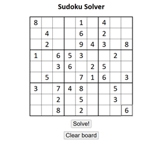
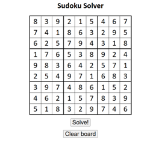

# 🧩 Sudoku Solver

  

  

A lightning-fast, web-based Sudoku solver that can tackle puzzles of any difficulty in milliseconds. This project implements an optimized backtracking algorithm with constraint propagation to efficiently solve even the most challenging Sudoku puzzles.

## ✨ Features

- **Instant Solutions**: Solves puzzles in milliseconds using an optimized backtracking algorithm
- **Interactive UI**: User-friendly interface for inputting and clearing puzzles
- **Difficulty Levels**: Pre-built examples of easy, medium, and hard puzzles
- **Input Validation**: Ensures puzzles are valid before attempting to solve
- **Visual Feedback**: Clear presentation of the solution

## 🚀 Demo

Try it out: Clone this repository and open `index.html` in your browser!

## 🔍 How It Works

This solver uses a recursive backtracking algorithm enhanced with constraint propagation:

1. Find an empty cell on the board
2. Determine all possible valid numbers for that cell
3. Try each number, recursively solving the rest of the board
4. If a solution is found, return it
5. If no solution is possible, backtrack and try the next number

This approach drastically reduces the search space compared to brute force methods, allowing even the hardest Sudoku puzzles to be solved efficiently.

## 💻 Usage

1. Open `index.html` in your browser
2. Input your Sudoku puzzle by typing numbers into the cells
3. Click "Solve!" to find the solution
4. Use "Clear board" to start over

## 🛠️ Technical Implementation

- **Frontend**: HTML, CSS, JavaScript
- **Algorithm**: Optimized recursive backtracking
- **Data Structure**: 9x9 grid represented as an 81-character string
- **Key Functions**:
  - `recursiveSolve()`: Core solving algorithm
  - `getNextCellAndPossibilities()`: Smart cell selection with constraint propagation
  - `boardIsValid()`: Validation system for rows, columns, and 3x3 boxes

## 🎓 Academic Context

This project was developed as part of CS3102: Design & Analysis of Algorithms. It demonstrates practical application of:

- Backtracking algorithms
- Constraint satisfaction problems
- Algorithm optimization techniques
- Time and space complexity analysis

## 👥 Contributors

This project was developed collaboratively by **Aatmaj Amol Salunke** and **Madhvendra Dixit**.

*This project showcases how elegant algorithms can efficiently solve complex puzzles that would be intractable with brute force approaches.*
